CUDA Stream Compaction
======================

**University of Pennsylvania, CIS 565: GPU Programming and Architecture, Project 2**

* Logan Dooley
  * [LinkedIn](https://www.linkedin.com/in/logan-dooley-a205a619a/)
* Tested on: Windows 11, 13th Gen Intel(R) Core(TM) i5-13420H (2.10 GHz), 16GB RAM, RTX 4050 Laptop

## Table of Contents
* [Overview](#overview)
* [Background](#background)
* [Methodology](#methodology)
* [Performance Analysis](#performance-analysis)
* [Extra Credit/Features](#extra-creditfeatures)
* [CMake Changes](#cmake-changes)
* [Build Information](#build-information)

## Overview

This project is an implementation and analysis of prefix sums, otherwise called scans, as well as stream compaction algorithms in CUDA. The project explores the usage of shared memory in optimizing these algorithms, as well as expanding these algorithms to support arbitrary array sizes.

## Background

### Prefix Sum/Scan

A prefix sum is an algorithm on an array which computes for each array index the sum of all prior elements. For example, the array: [1, 3, 6, 2] when run through the scan algorithm would yield the result [0, 1, 4, 10]. 

This particular variant in which we do not include the element at the specified index in the sum is called an "exclusive scan" which is the variant I implement here. Another variant which does include the element at the specified index is called an "inclusive scan". This would yield on the same array: [1, 4, 10, 12].

### Stream Compaction

Stream compaction is an algorithm in which we reduce an array to a subarray containing only the elements which meet a certain condition. For example if the array is [-1, 5, -6, 7, 2] and the condition is the element must be postive, we are left with the array [5, 7, 2]. 

## Methodology

The techniques used to implement the scan algorithm on the GPU are detailed in the following GPU Gems article: https://developer.nvidia.com/gpugems/gpugems3/part-vi-gpu-computing/chapter-39-parallel-prefix-sum-scan-cuda

The overall method roughly follows splitting the problem into a tree like structure where at each level of the tree, 2 elements are added together.

For stream compaction, we can utilize a scan to evaluate the algorithm. The steps of stream compaction are:
1. Create a binary array of elements meeting the condition
2. Run an exclusive scan over the binary array
3. Scatter the original elements to the index they correspond to in the scan, if they met the condition

This would look something like:
[-1, 5, -6, 7, 2]
1. Create the binary array of elements meeting the condition of being greater than 1. [0, 1, 0, 1, 1]
2. Run an exclusive scan over the binary array. [0, 0, 1, 1, 2, 3]
3. Scatter the elements of the original array to their index according to the scan if they meet the condition. [5, 7, 2, _, _]

## Test Run

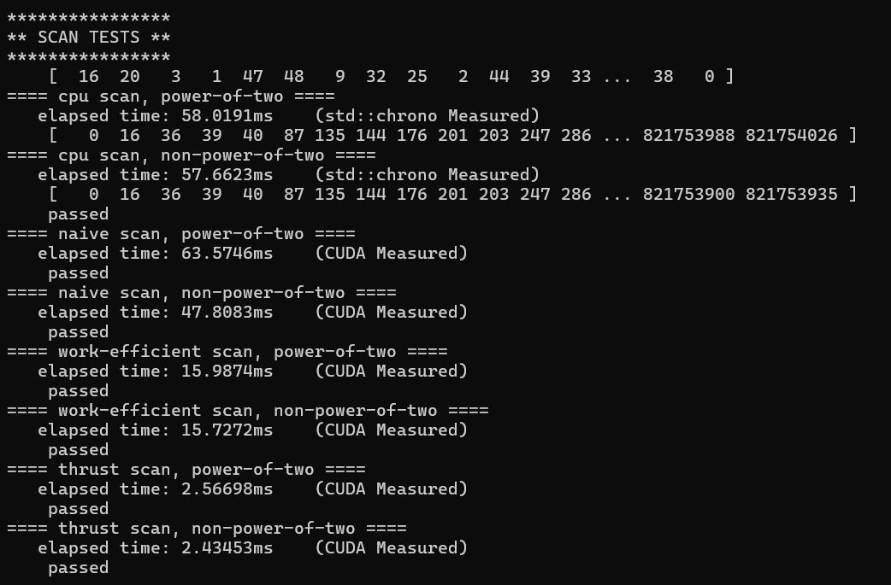

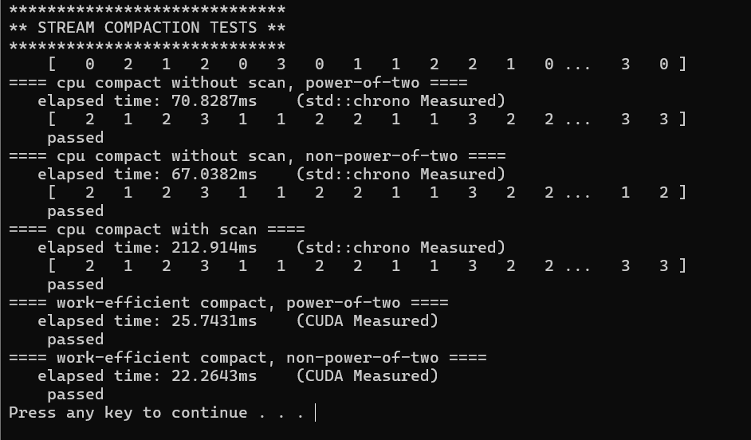

## Performance Analysis


### Effect of Block Size
To begin, I evaluated my scan algorithms, both naive and work-efficient approaches with and without use of shared memory across different block sizes to see if there is a noticable performance difference. For this test, I ran 20 samples of each algorithm on an array size of 2^25 elements. The duration was evaluated from the time the data was on the GPU, to the time the algorithm completed with output data also still on the GPU to avoid measuring CPU<->GPU transfer time.

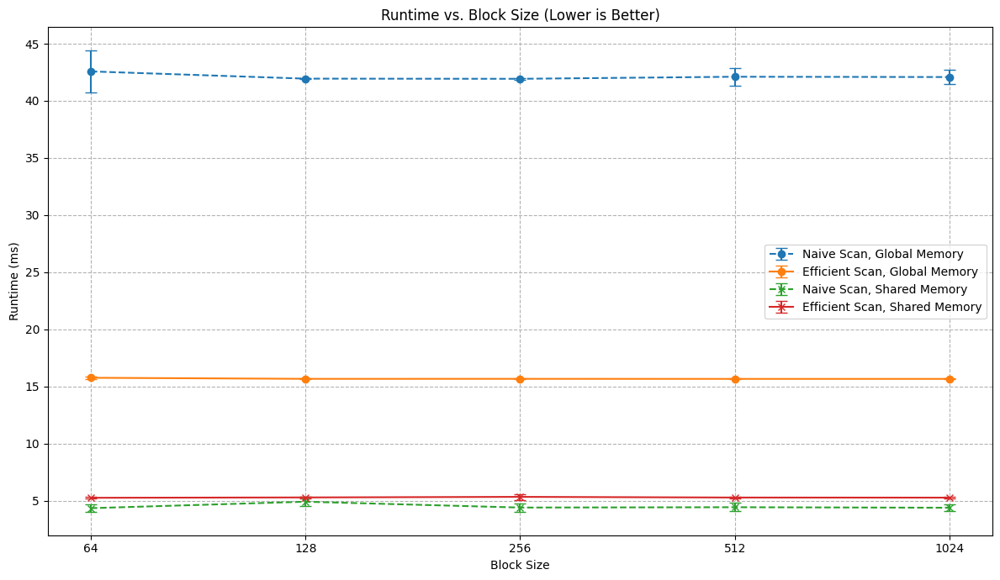

From this, we see there was little to no impact of block size on the algorithms runtime. For this reason, I chose a block size of 256 moving forward for all future performance tests.

### Effect of Array Size

For the following tests, I ran each algorithm 50 times and for the GPU algorithms the duration was measured from the time the input data was on the GPU to the time valid output data was available on the GPU. For CPU algorithms the duration was measured from the time the input data was on the CPU to the time valid output data was on the CPU. Each plot point is given error bars which correspond to the standard deviation of the 50 samples.

#### Scan w/ Power of Two Array Sizes

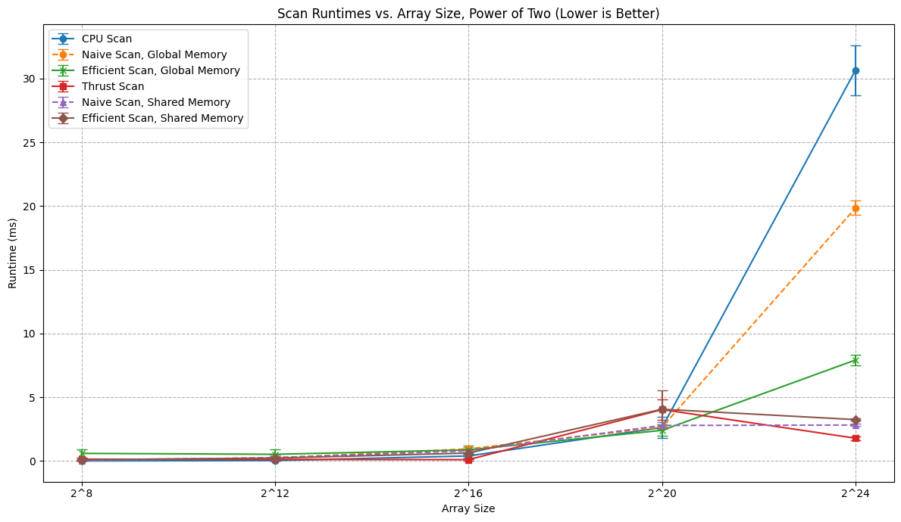

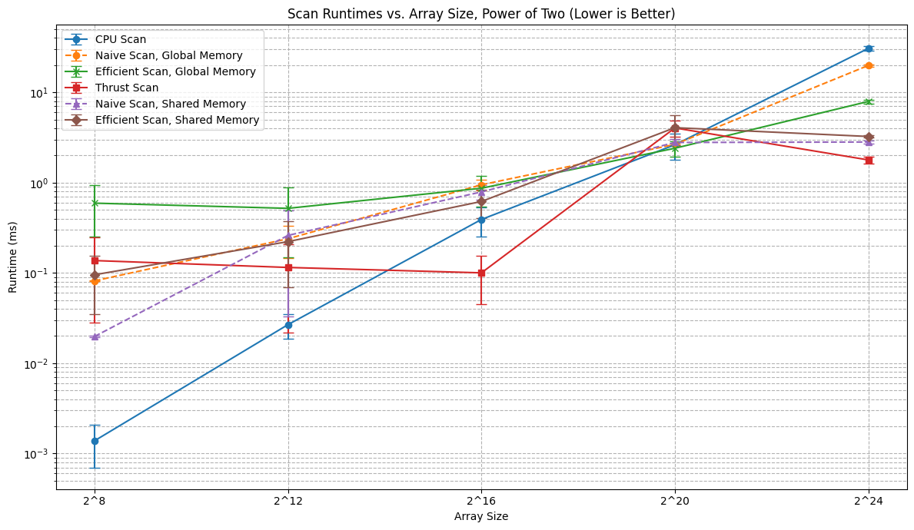

The first graph shows the comparison of algorithm implementations on a linear scale for the y axis, whereas the second graph uses a logarithmic scale for the y axis.

From these, we can see that on small array sizes, the CPU scan dominates the other algorithms. However, at 2^16 elements, we start to see that thrust's implementation surpasses the CPU scan, and finally at 2^24 elements the CPU scan is now dominated by every GPU implementation. Notably we see for the GPU implementations that the Thrust scan is the fastest, followed by the Naive scan using shared memory, then the work efficient scan using shared memory, then the work efficient scan using global memory, and finally the naive scan using global memory.

#### Scan w/o Power of Two Array Sizes

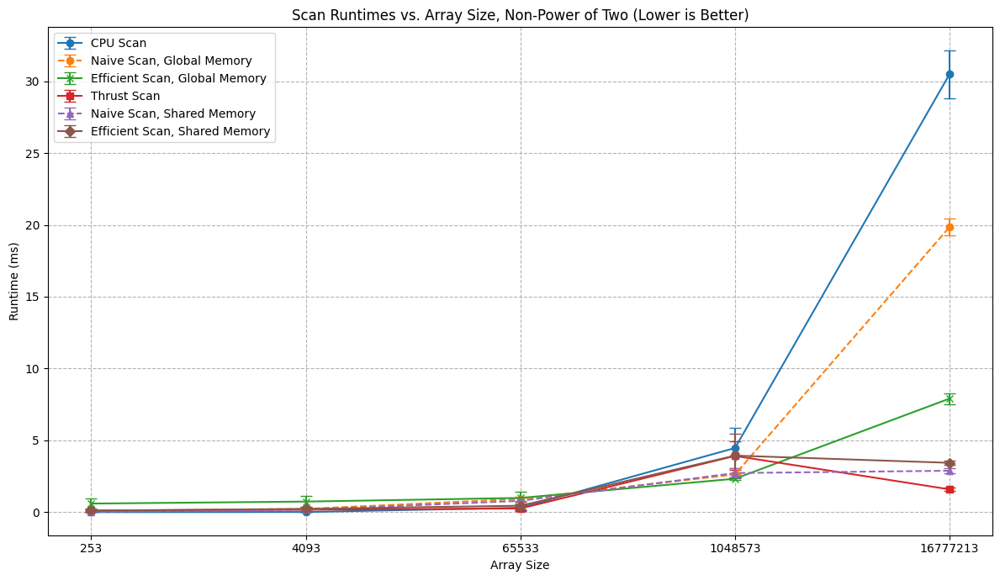

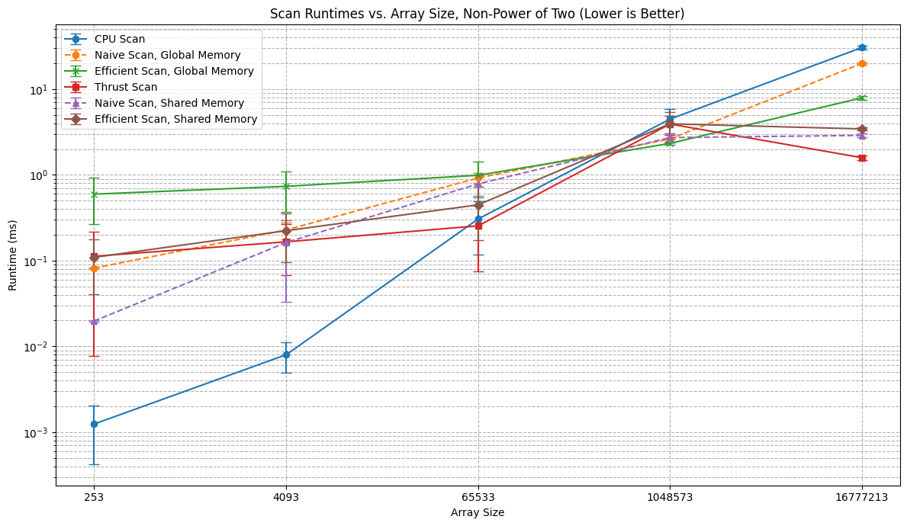

For non-powers of two, we see a similar pattern for relative performance between the scan algorithms, this is likely because they are padded to the next power of two and treated the same as a power of two array in that case.

#### Stream Compaction w/ Power of Two Array Sizes

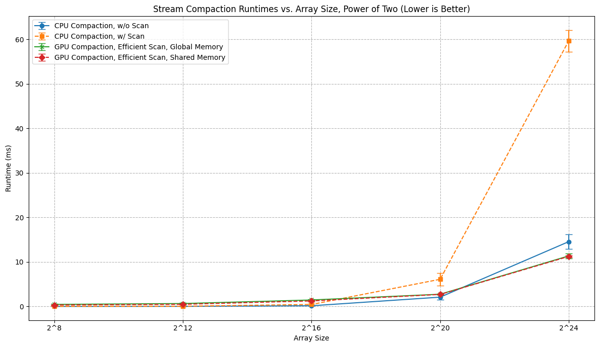

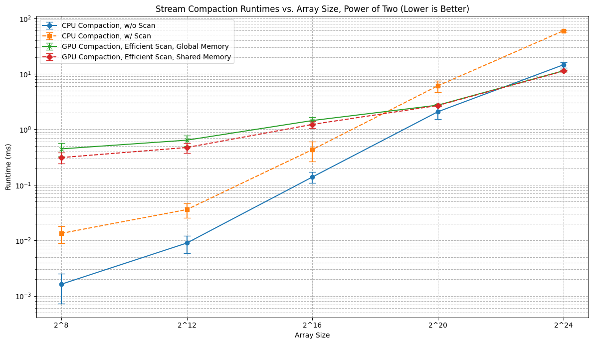

For stream compaction we see a similar trend where for array sizes up to 2^20, the CPU implementations can be faster, but are edged out by the GPU implementations for very large arrays at 2^24 elements. Both using shared and global memory for the efficient scan performed similarly, which indicates that the bottleneck of the stream compaction algorithm is not the scan itself, as the rest of the implementations are identical. 

#### Stream Compaction w/o Power of Two Array Sizes

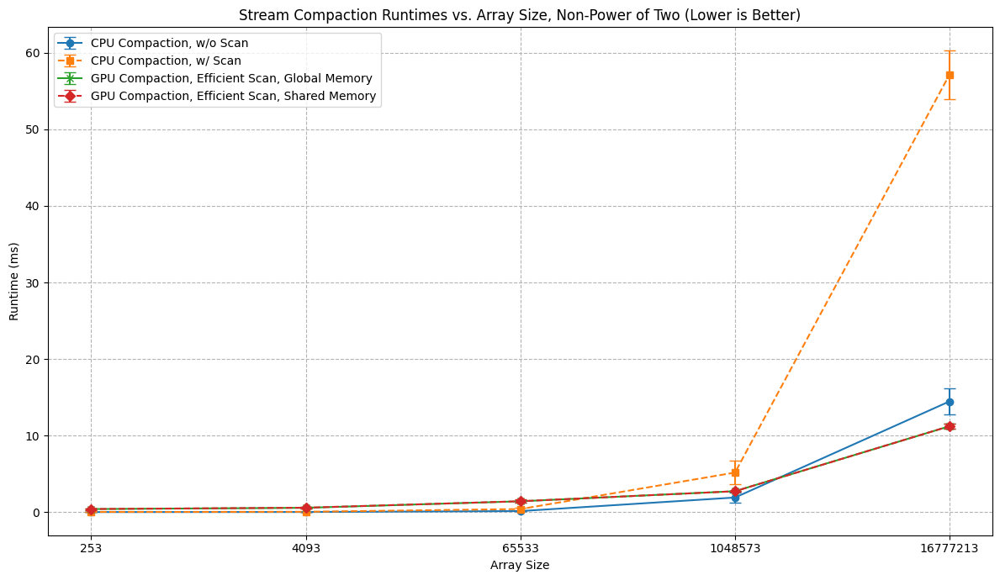

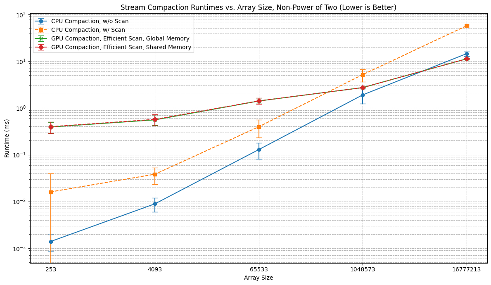

Non power of two array sizes exhibit similar runtimes and relative performance between algorithms, likely again because the scan ends up operating over the same number of elements as if it was a power of two.

### Thrust Implementation Analysis

From NSight Systems, the timeline of the thrust scan implementation is as follows:

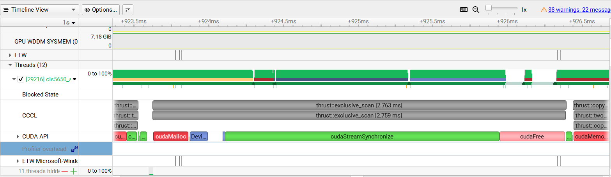

cudaStreamaSynchronize is an event used to wait for an asynchronous kernel launch to complete, so that time is mostly dedicated to the scan kernel actually performing. As a result, the vast majority of thrust's implementation is spent in the actual kernel, with relatively minor contributions from a cudaMalloc call at the start and cudaFree at the end.

### Bottlenecks


## Extra Credit/Features

### Why the GPU Efficient Scan is Slow

One possible reason the work efficient scan is still slow if implemented directly from the slides is that the algorithm uses strided checks for which threads are doing work at any given level. If all n threads are launched every iteration, at the top most level, every other thread is doing work, at the next level, every 4th thread is doing work, at the next level every 8th thread is doing work and so forth. This means there is high warp divergence, and lots of threads not doing meaningful work. This is reduced in my implementation by changing the indexing pattern such that all the threads doing work are the first n threads, rather than the active threads being strided out. 

For example in my upsweep implementation I calculate 
```
int k = index * stride;

if (k + stride - 1 >= dataLength) {
    return;
}

dev_data[k + stride - 1] = dev_data[k + halfStride - 1] + dev_data[k + stride - 1];
```

In doing so, thread 0 corresponds to k = 0, thread 1 is k = stride, thread 2 is k = 2 * stride and so forth. As a result, the threads doing work are sequential at the start, and this also lets me launch kernels with less threads than the total number of elements in the array.

### Shared Memory Usage

For both the naive and work-efficient implementations they can be switched to work with shared memory as I have done so. This can be enabled in the project by changing the defines in naive.cu and efficient.cu for ```NAIVE_USE_SHARED_MEMORY``` and ```EFFICIENT_USE_SHARED_MEMORY``` respectively.

The idea with these modifications is that we split the large array up into chunks, such that each chunk can fit into a block. Then, we launch a kernel which first loads all of that chunk's data into shared memory, and then performs the entire scan algorithm in the one kernel thorugh a loop. Once completed, these chunks then each save off their total sum into a "chunk sums" array. This chunk sums array itself can be scanned, and then added index by index to the scanned individual chunks that we started with to give the full array sum.

One caveat to this is if the chunk sums array cannot be scanned in a single block, it must also be broken up into chunks and this process is to be applied recursively until a chunk sums array can be computed within a single block. The way I chose to break down my arrays and chunks is such that the original array is padded to the nearest power of two, and I choose a power of two size for the size of the chunks to process. This guarantees that I am left with a power of two for the number of chunks to process in the recursive step, and as such I only need to pad once at the very beginning.

If we view the performance graph of runtime vs. array size from the original performance analysis, we can see that the shared memory implementations do perform better than their global memory counterparts. In particular for the large array sizes of 2^24 elements this distinction becomes even more clear.


#### Shared Memory Extensions
One of the issues of the shared memory implementation is bank conflicts. These are prevalent in the work efficient implementation due to the stride based behavior leading to many threads within a block eventually trying to read indexes that are multiples of 32 of one another. In the GPU Gems article, these are addressed by adding padding to the array. In particular in shared memory only, while copying in the data from global memory, one piece of padding is placed every 32 elements such that each set of 32 is now offset by 1 element from that before it. This effectively reduces the number of bank conflicts substantially.

Running 50 samples on the work-efficient shared memory implementation for various array sizes with and without the conflict-free indexing optimization enabled yielded the following results for mean runtimes:

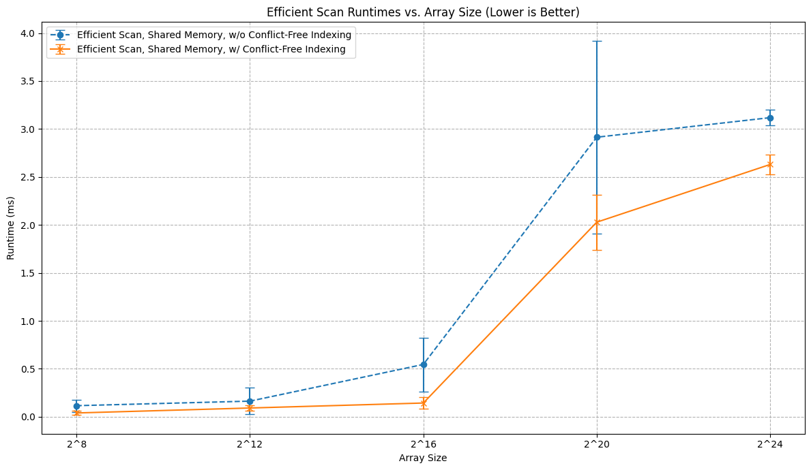

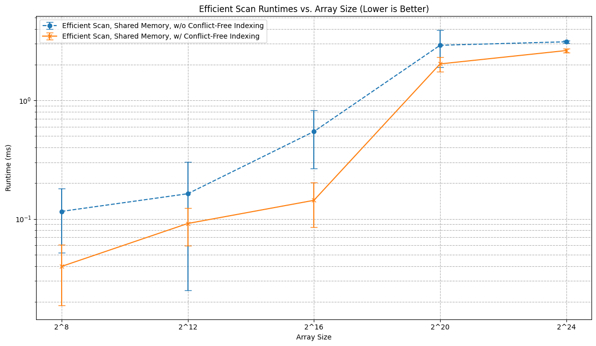

From this, we see that there is a significant improvement in performance for the conflict-free indexing approach as to not across all array sizes.

## CMake Changes

N/A

## Build Information

